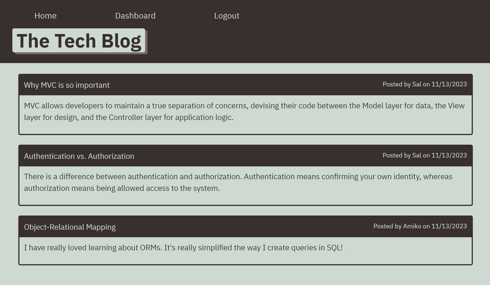
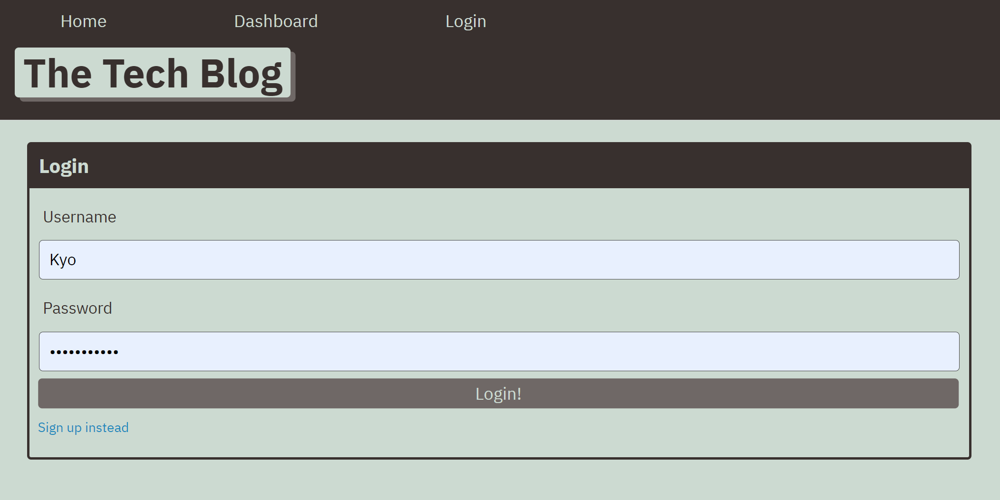
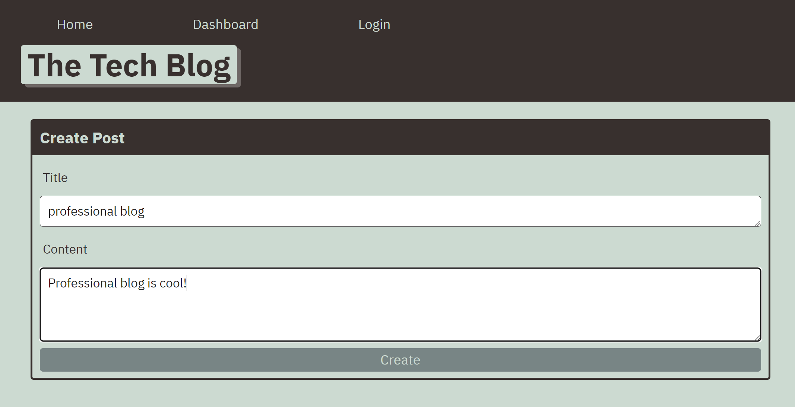
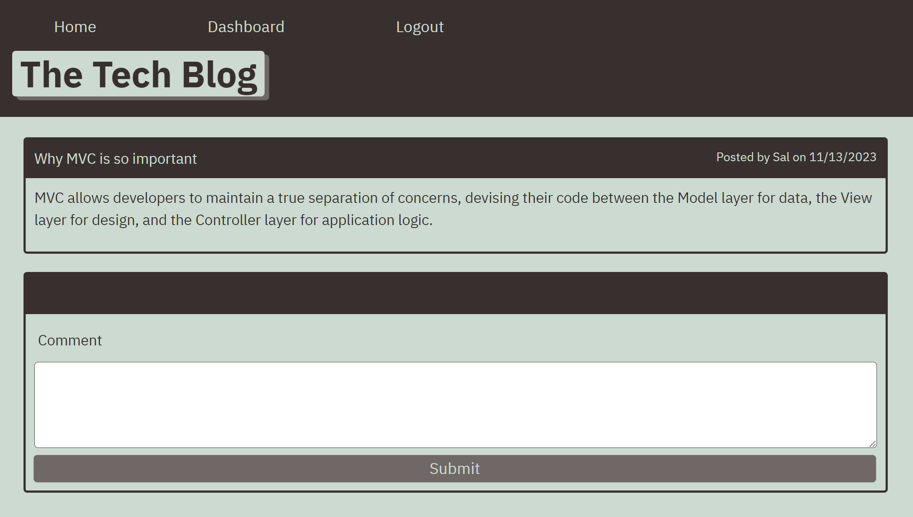
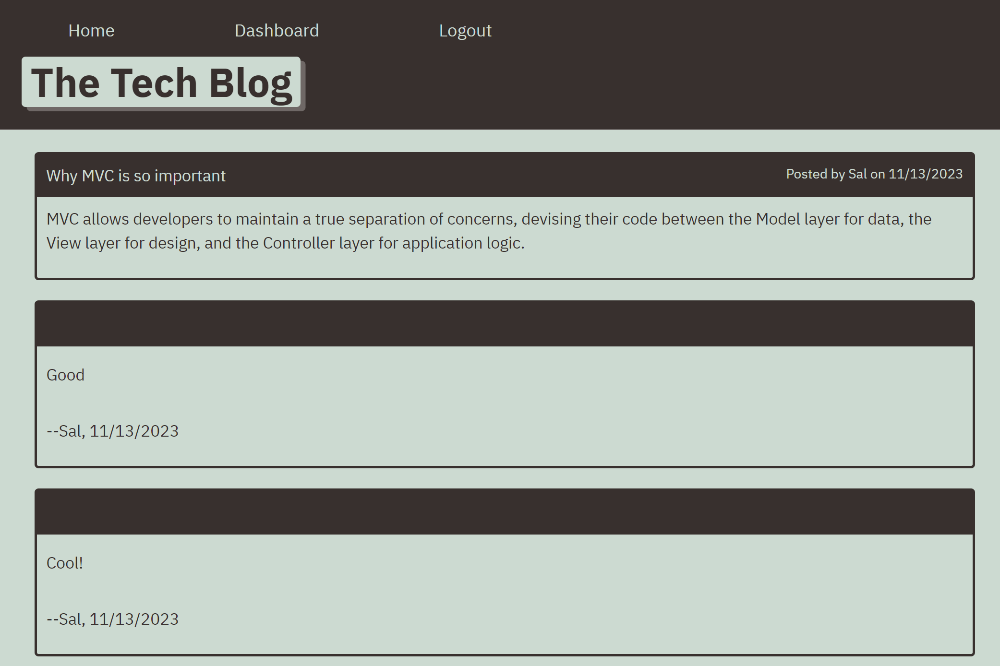

# Tech Blog
  
## Description

Tech-Blog is for developers who write CMS-style tech blog posts.
This application can provide publish articles, blog posts, and add comments.

## Features

This Tech-Blog application provides the following functinalities.

* WHEN you visit the site for the first time, THEN you are presented with the homepage, which includes existing blog posts if any have been posted; navigation links for the homepage and the dashboard; and the option to log in 

* WHEN you click on the homepage option, THEN you are taken to the homepage

* WHEN you click on any other links in the navigation, THEN you are prompted to either sign up or sign in

* WHEN you choose to sign up, THEN you are prompted to create a username and password

* WHEN you click on the sign-up button, THEN your user credentials are saved and you are logged into the site

* WHEN you revisit the site at a later time and choose to sign in, THEN you am prompted to enter your username and password

* WHEN you are signed in to the site, THEN you see navigation links for the homepage, the dashboard, and the option to log out

* WHEN you click on the homepage option in the navigation, THEN you are taken to the homepage and presented with existing blog posts that include the post title and the date created

* WHEN you click on an existing blog post, THEN you are presented with the post title, contents, post creator's username, and date created for that post and have the option to leave a comment

* WHEN you enter a comment and click on the submit button while signed in, THEN the comment is saved and the post is updated to display the comment, the comment creator's username, and the date created

* WHEN you click on the dashboard option in the navigation, THEN you are taken to the dashboard and presented with any blog posts you have already created and the option to add a new blog post

* WHEN you click on the button to add a new blog post, THEN you are prompted to enter both a title and contents for your blog post.

* WHEN you click on the button to create a new post, THEN the title and contents of your post are saved and you are taken back to an updated dashboard with your new blog post

* WHEN you click on one of your existing posts in the dashboard, THEN you are able to delete or update your post and taken back to an updated dashboard

* WHEN you click on the logout option in the navigation, THEN you are signed out of the site

* WHEN you are idle on the site for more than a set time, THEN you are able to view posts and comments but you are prompted to log in again before you can add, update, or delete posts.

## Direct Access from Heroku
https://cool-tech-blog-c417147650ea.herokuapp.com/

## Installation on your local machine
* After downloading from GitHub, you can run this program on your local machine by following the procedure below:
1. Get into your mysql account by running `mysql -u <username> -p`, and insert your mysql password after prompting.
2. On another terminal, run `source <source code path>\db\schema.sql` to initialize database.
3. Inside the same terminal, run `npm run seed` for seeding the database table.
4. At the same terminal, run `nodemon server.js` to run the backend server for tech-blog.
5. On an internet browser, type in the URL `localhost:3001`.
6. You're ready to go!

## Source Code References
  This project has used some reference codes from the following sites

   * https://git.bootcampcontent.com/University-of-Texas-at-Austin/UTA-VIRT-FSF-PT-07-2023-U-LOLC.git   

## Contact
  * Author: Kyosook Shin
  * Author's Email: kyosook.shin@gmail.com  
  * GitHub: https://github.com/alla0810/tech-blog
  * Heroku: https://cool-tech-blog-c417147650ea.herokuapp.com/

## Screenshot  

  

  
  
  
